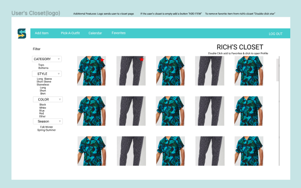
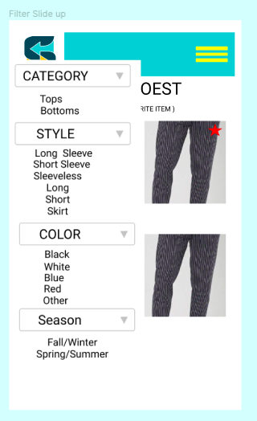
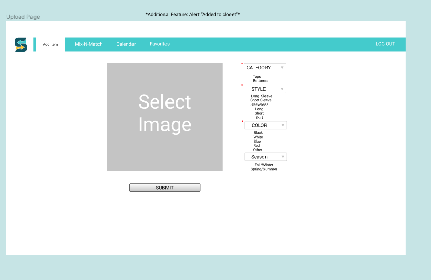
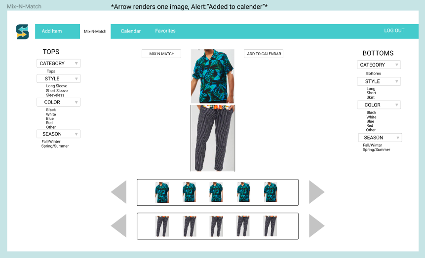
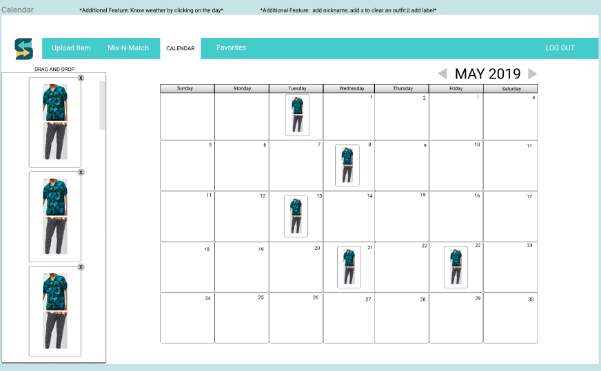

# SwitchItProject
SwitchIt is a virtual closet app used to help our users organize their wardrobes, with a simply click of a button. Users have the ability to upload images of their items to their closets, plan outfits in advance with our calendar feature, and help users decide what to wear on the fly with our random outfit generator feature.

## Wireframes
Created with Figma.com

```bash
Closet Page:




Upload Images Page:


Mix-and-Match Page:


Calendar Page:



```

# Meet The Team
Linked and Github Profiles

## [Victoria Buchanan]
- (https://www.linkedin.com/in/victoria-buchanan/)
- (https://github.com/VictoriaBuchanan27)
## [Serge Enama]
- (https://www.linkedin.com/in/serge-enama/)
- (https://github.com/Senama)
## [Richard Green]
- (https://www.linkedin.com/in/richard-green11/) 
- (https://github.com/rgreen11)
## [Jennifer Perez]
- (https://www.linkedin.com/in/jennifer-perez15/)
- (https://github.com/JennMP88)
## [Van Tran]
- (https://www.linkedin.com/in/van-tran-ny/)
- (https://github.com/vantran23)


